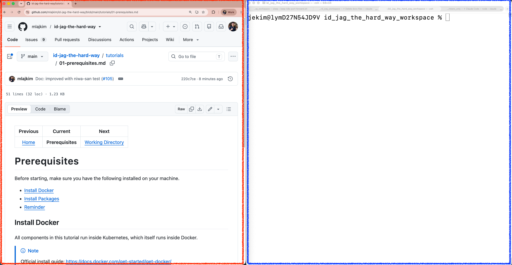

| 前へ | 現在 | 次へ |
|:---:|:---:|:---:|
| [作業ディレクトリ](./01-working-directory.md) | **事前準備** | [Kubernetes クラスター](./03-kubernetes-cluster.md) |

<a id="prerequisites"></a>

# 事前準備

演習に必要なツールをインストールし、ローカル環境を準備します。コマンドは macOS または Linux の Bash 互換シェルと Homebrew を前提とします。Windows では WSL を使用してください。

<!-- TOC depthFrom:2 depthTo:2 -->

- [Docker をインストールする](#install-docker)
- [パッケージをインストールする](#install-packages)
- [作業画面を配置する](#arrange-your-workspace)
- [チュートリアルの範囲](#scope-of-this-tutorial)

<!-- /TOC -->

<a id="install-docker"></a>

## Docker をインストールする

API、MCP サーバー、ゲートウェイ、Athenz、Keycloak は、kind（Kubernetes in Docker）で作成するローカル Kubernetes クラスターで実行します。クライアントの経路に応じて使う Claude Code、Codex CLI、Ollama はホストマシンで実行します。

> [!NOTE]
> 公式インストールガイド：https://docs.docker.com/get-started/get-docker/

Docker が起動していることを確認します：

```sh
docker ps
```

```sh
# CONTAINER ID   IMAGE     COMMAND   CREATED   STATUS    PORTS     NAMES
```

<a id="install-packages"></a>

## パッケージをインストールする

> [!NOTE]
> Homebrew: https://brew.sh/

Homebrew をインストールします：

```sh
/bin/bash -c "$(curl -fsSL https://raw.githubusercontent.com/Homebrew/install/HEAD/install.sh)"
```

続いて、次のパッケージをインストールします：

```sh
brew install jq gh kubectl kind
```

<a id="open-up-two-screens"></a>

<a id="arrange-your-workspace"></a>

## 作業画面を配置する

チュートリアルとターミナルを並べると、各手順を読み、実行し、結果を比較しやすくなります。次の例では、左にチュートリアル、右にターミナルを配置しています。



<a id="reminder"></a>

<a id="scope-of-this-tutorial"></a>

## チュートリアルの範囲

このチュートリアルはアーキテクチャを理解するための演習です。運用環境に必要なセキュリティ設定をすべて備えているわけではありません。完成した環境をそのまま本番運用に使わないでください。

必要なツールがそろいました。次の章ではローカル Kubernetes クラスターを作成します。

次へ：[Kubernetes クラスター](./03-kubernetes-cluster.md)
