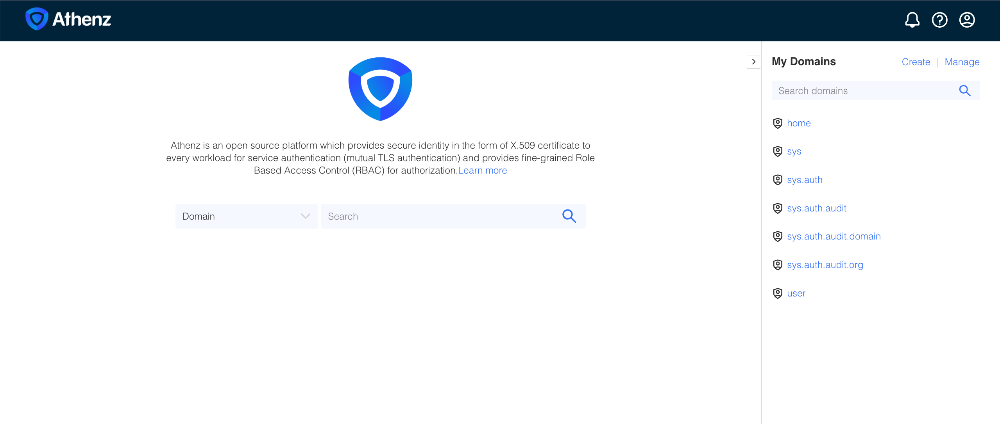

| 前へ | 現在 | 次へ |
|:---:|:---:|:---:|
| [リソースサーバー（Resource Server）](./04-resource-server.md) | **認可サーバー（Authorization Server）** | [アクセストークン（Access Token）](./06-access-token.md) |

<a id="authorization-server"></a>

# 認可サーバー（Authorization Server）

この章では Athenz をローカルの認可サーバーとしてデプロイします。続いて `mcp` と `api` の両ドメインのスコープ（Scope）を使えるよう設定し、動作を確認します。

<!-- TOC depthFrom:2 depthTo:2 -->

- [Athenz サーバーをデプロイする](#deploy-athenz-server)
- [複数ドメインのスコープを許可する](#enable-scopes-across-multiple-domains)
- [Athenz のデプロイを確認する](#verify-the-athenz-deployment)
- [主要エンドポイントにローカルからアクセスする](#keep-core-endpoints-locally-reachable)
- [Athenz UI を開く](#open-athenz-ui)

<!-- /TOC -->

<a id="deploy-athenz-server"></a>

## Athenz サーバーをデプロイする

次のコマンドを実行します：

```sh
git submodule update --init --recursive
make -C athenz_dist clean-kubernetes-athenz deploy-kubernetes-athenz
```

```sh
# ...
# namespace/athenz unchanged
# configmap/athenz-ui-config created
# secret/athenz-admin-keys configured
# secret/athenz-ui-keys created
# service/athenz-ui created
# deployment.apps/athenz-ui created
```

> [!NOTE]
> デプロイの詳細は[Athenz の配布版ガイド](https://github.com/athenz-community/athenz-distribution/blob/main/README.md)を参照してください。

<a id="enable-scopes-across-two-domains"></a>

<a id="enable-scopes-across-multiple-domains"></a>

## 複数ドメインのスコープを許可する

このチュートリアルで使う `mcp` と `api` の両ドメインのスコープを許可するよう、ZTS を設定します：

```sh
_zts_java_opts=$(kubectl -n athenz get deployment/athenz-zts-server \
  -o jsonpath='{.spec.template.spec.containers[?(@.name=="athenz-zts-server")].env[?(@.name=="JAVA_OPTS")].value}')
kubectl -n athenz set env deployment/athenz-zts-server \
  --containers=athenz-zts-server \
  "JAVA_OPTS=${_zts_java_opts} -Dathenz.zts.access_token_max_domains=10"
kubectl -n athenz rollout status deployment/athenz-zts-server
```

```sh
# deployment.apps/athenz-zts-server env updated
# Waiting for deployment "athenz-zts-server" rollout to finish: 0 out of 1 new replicas have been updated...
# Waiting for deployment "athenz-zts-server" rollout to finish: 0 of 1 updated replicas are available...
# Waiting for deployment "athenz-zts-server" rollout to finish: 0 of 1 updated replicas are available...
# deployment "athenz-zts-server" successfully rolled out
```

このコマンドで ZTS Pod の設定を変更します。各トークンの受信先（audience）は引き続き一つです。別ドメインのスコープにはドメイン名が付き、後のトークン交換（Token Exchange）でも区別されます。

<a id="check-athenz-server-running"></a>

<a id="verify-the-athenz-deployment"></a>

## Athenz のデプロイを確認する

> [!NOTE]
> すべての Athenz サーバーが利用できるようになるまで、5～10 分ほどかかる場合があります。

Athenz の各コンポーネントの準備が完了するまで待ちます：

```sh
_athenz_components=(
  "athenz-db"
  "athenz-cli"
  "athenz-zms-server"
  "athenz-zts-server"
  "athenz-ui"
)

echo "Waiting for athenz servers to be ready ..."

for component in "${_athenz_components[@]}"; do
  kubectl wait -n athenz \
    --for=condition=ready pod \
    --selector=app.kubernetes.io/name=$component \
    --timeout=180s || echo "Timed out waiting for $component. Check logs manually."
done
```

```sh
# Waiting for athenz servers to be ready ...
# pod/athenz-db-0 condition met
# pod/athenz-cli-574d747dff-mfdgz condition met
# pod/athenz-zms-server-568d4cfd89-tqwwn condition met
# pod/athenz-zts-server-6966ff7f66-4j67d condition met
# pod/athenz-ui-59f7f77667-5rpf7 condition met
```

Pod が稼働していることを確認します：

```sh
kubectl get pods -n athenz
```

```sh
# NAME                                 READY   STATUS    RESTARTS   AGE
# athenz-cli-574d747dff-mfdgz          1/1     Running   0          87s
# athenz-db-0                          1/1     Running   0          88s
# athenz-ui-59f7f77667-5rpf7           2/2     Running   0          87s
# athenz-zms-server-568d4cfd89-tqwwn   1/1     Running   0          87s
# athenz-zts-server-6966ff7f66-4j67d   1/1     Running   0          87s
```

<a id="keep-core-endpoints-locally-reachable"></a>

## 主要エンドポイントにローカルからアクセスする

Pod が再起動すると `kubectl port-forward` は終了することがあります。そのため、ポート転送を維持する仕組みが必要です。

ポート転送ツールを起動します。既定のポートが使用中の場合は、別のポートを選ぶよう案内されます。

> [!IMPORTANT]
> 後のコマンドを実行するターミナルを使えるように、ポート転送ツールは別のタブで起動してください。

```sh
./tools/keep-k8s-port-forward.sh
```

> [!TIP]
> 同じターミナルを使い続けたい場合は、コマンド末尾に `&` を付けてバックグラウンドで起動できます。これは任意です。

<a id="open-athenz-ui"></a>

## Athenz UI を開く

Athenz UI を開きます：

```sh
_athenz_ui_port=$(./tools/port.sh athenz-ui)
./tools/open.sh "http://localhost:${_athenz_ui_port}"
```



次の章では API ドメインを作成し、スコープを指定したアクセストークン（Access Token）をリクエストします：

次へ：[アクセストークン（Access Token）](./06-access-token.md)
