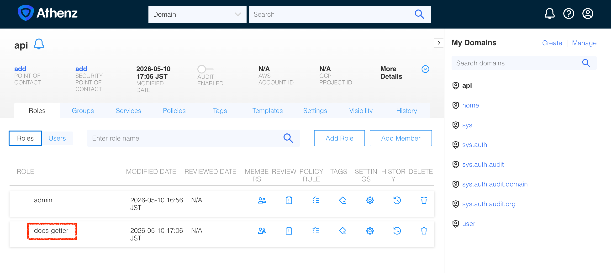
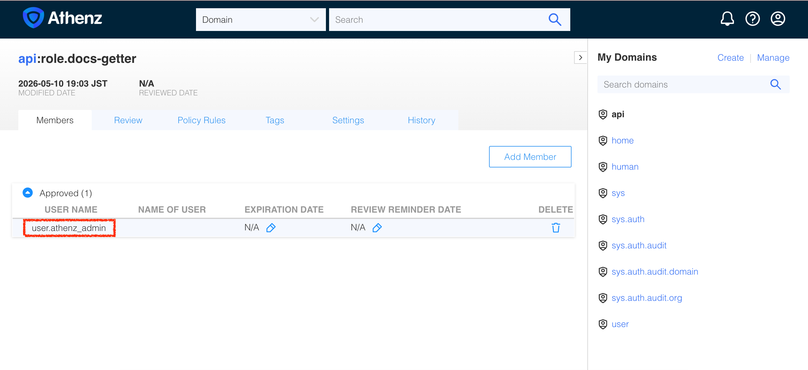

| 前へ | 現在 | 次へ |
|:---:|:---:|:---:|
| [認可サーバー（Authorization Server）](./05-authorization-server.md) | **アクセストークン（Access Token）** | [権限の細分化](./07-granular-permission.md) |

<a id="access-token"></a>

# アクセストークン（Access Token）

ここまでにリソースサーバーでアクセストークンの検証を有効にし、認証情報のないリクエストが失敗することを確認しました。次は API が Athenz を信頼するよう設定し、アクセストークンを取得して文書を読みます。

<!-- TOC depthFrom:2 depthTo:2 -->

- [API ドメインを作成する](#create-the-api-domain)
- [ZTS の署名鍵エンドポイントを信頼する](#trust-the-zts-signing-key-endpoint)
- [文書閲覧用のロールを作成する](#create-the-document-reading-role)
- [API に必要なスコープを理解する](#understand-the-required-api-scopes)
- [管理者をロールに追加する](#add-the-administrator-to-the-role)
- [管理者としてトークンをリクエストする](#request-a-token-as-the-administrator)
- [保護された API を呼び出す](#call-the-protected-api)
- [結果を確認する](#review-the-result)
- [次のステップ](#next-steps)

<!-- /TOC -->

<a id="create-the-api-domain"></a>

## API ドメインを作成する

API を表す Athenz ドメインを作成します：

```sh
./tools/athenz/create-tld.sh "api"
```

```sh
#   ·  Creating TLD: api...
#   ✔  TLD created: api
```

このドメインは、リソースサーバーをデプロイしたときに作成した Kubernetes ネームスペース `api` とは別のものです。

<a id="trust-the-zts-signing-key-endpoint"></a>

## ZTS の署名鍵エンドポイントを信頼する

API は ZTS の公開署名鍵でアクセストークンを検証します。Node.js が ZTS との HTTPS 接続を検証できるよう、チュートリアルの CA をマウントします：

```sh
kubectl -n api create configmap api-zts-ca \
  --from-file=ca.crt=./athenz_dist/certs/ca.cert.pem

kubectl patch deploy api-server -n api --patch "$(cat <<'EOF'
spec:
  template:
    spec:
      containers:
        - name: idthw-demo-api
          env:
            - name: NODE_EXTRA_CA_CERTS
              value: /var/run/athenz/ca.crt
          volumeMounts:
            - name: zts-ca
              mountPath: /var/run/athenz
              readOnly: true
      volumes:
        - name: zts-ca
          configMap:
            name: api-zts-ca
EOF
)"
kubectl rollout status deploy/api-server -n api
```

コンテナ名は、リソースサーバーのイメージに対応する `idthw-demo-api` です。Deployment と Service の名前は `api-server` です。

API が ZTS の HTTPS 証明書を信頼できない場合、アクセストークンを付けたリクエストにも `503 Service Unavailable` を返します：

```json
{
  "error": "zts_ca_untrusted",
  "message": "Cannot verify the ZTS HTTPS certificate. Mount the CA certificate that signed it, set NODE_EXTRA_CA_CERTS to its path, and restart the API."
}
```

この場合も API Pod は稼働を続け、`/healthz` は `200 OK` を返します。上記の CA 設定を適用するとトークンを検証できるようになります。

<a id="create-athenz-role-under-the-api-domain"></a>

<a id="create-the-document-reading-role"></a>

## 文書閲覧用のロールを作成する

Athenz は**ロールベースのアクセス制御（Role-Based Access Control, RBAC）**を使います。ZTS はリクエスト元が対象ロール（Role）のメンバーか確認し、そのスコープ（Scope）を含むトークンを発行します。API はスコープに要求された操作の権限があるか確認します。

文書の閲覧には `api:role.docs-getter` スコープが必要です。まずこのロールを作成します。

> [!NOTE]
> `create-role.sh` は空のロール定義を ZMS API に PUT し、指定したドメインにロールを作成します。`cat ./tools/athenz/create-role.sh` で内容を確認できます。

スクリプトを実行し、`api` ドメインに `docs-getter` ロールを作成します：

```sh
UI_OPEN=true ./tools/athenz/create-role.sh "api" "docs-getter"
```

```sh
#   ·  Creating Role: api:role.docs-getter...
#   ✔  Role created: api:role.docs-getter
#   ✔  Opened: http://localhost:3000/domain/api/role
```

ロールを作成すると、Athenz UI でそのロールのページが開きます。



<a id="understand-the-required-api-scopes"></a>

## API に必要なスコープを理解する

API は信頼する ZTS の署名鍵でトークンの署名を検証し、有効期限と受信先（audience）が `api` であることを確認します。操作ごとに次のスコープが必要です：

| 操作 | 必要なスコープ |
|---|---|
| `GET /api/docs` | `api:role.docs-getter` |
| `POST /api/docs` | `api:role.docs-poster` |
| `DELETE /api/docs/{doc_id}` | `api:role.docs-deleter` |

API は `scope` または `scp` クレームを読みます。audience が `api` だけなら、`docs-getter` のようなドメイン名を省略したロール名も受け付けます。閲覧用トークンでは文書を作成・削除できません。

操作とスコープの対応は API 内で定義します。API は Athenz の action/resource ポリシーを取得・評価しません。トークンの発行は ZTS が制御します。ロールからメンバーを削除すると、ZTS が変更を反映した後は新しいトークンを取得できなくなります。ただし発行済みのトークンは有効期限まで利用できる場合があります。

<a id="add-root-user-as-a-member"></a>

<a id="add-the-administrator-to-the-role"></a>

## 管理者をロールに追加する

Athenz のデプロイには、管理者プリンシパル（Principal）`user.athenz_admin` の証明書が含まれます。最初のトークン取得ではこの証明書を使います。ZTS はリクエスト元が要求するスコープのロールに属している場合にトークンを発行します。

> [!NOTE]
> `add-role-member.sh` は ZMS API を通じてロールにメンバーを PUT し、そのプリンシパルにロールの権限を与えます。`cat ./tools/athenz/add-role-member.sh` で内容を確認できます。

`user.athenz_admin` を `api` ドメインの `docs-getter` ロールに追加します：

```sh
./tools/athenz/add-role-member.sh "api" "docs-getter" "user.athenz_admin"
```

`user.athenz_admin` が `api` ドメインの `docs-getter` ロールに追加されたことを確認します：

```sh
_athenz_ui_port=$(./tools/port.sh athenz-ui)
./tools/open.sh "http://localhost:${_athenz_ui_port}/domain/api/role/docs-getter/members"
```



<a id="get-access-token-as-root-user"></a>

<a id="request-a-token-as-the-administrator"></a>

## 管理者としてトークンをリクエストする

> [!NOTE]
> `fetch-access-token.sh` は ZTS のトークンエンドポイントに `client_credentials` グラントを POST し、要求したロールのスコープを含む署名済み Athenz アクセストークンを返します。`cat ./tools/athenz/fetch-access-token.sh` で内容を確認できます。

Athenz のデプロイで生成された管理者の証明書と鍵でスクリプトを実行し、出力を `_root_user_at` 変数に保存します。

```sh
_scope="api:role.docs-getter"
_root_user_at=$(./tools/athenz/fetch-access-token.sh \
  "./athenz_dist/certs/athenz_admin.cert.pem" \
  "./athenz_dist/keys/athenz_admin.private.pem" \
  "${_scope}" \
  "./keys/api_docs-getter.jwt")
```

```sh
#   ·  Fetching Access Token for scope: api:role.docs-getter...
#   ✔  Access token issued for scope: api:role.docs-getter
# {
#   "kid": "athenz-zts-server-6966ff7f66-4j67d",
#   "typ": "at+jwt",
#   "alg": "RS256"
# }
# {
#   "sub": "user.athenz_admin",
#   "scp": [
#     "docs-getter"
#   ],
#   "ver": 1,
#   "iss": "athenz-zts-server-6966ff7f66-4j67d",
#   "client_id": "user.athenz_admin",
#   "aud": "api",
#   "uid": "user.athenz_admin",
#   "auth_time": 1778407550,
#   "scope": "docs-getter",
#   "cnf": {
#     "x5t#S256": "ify-xpF2OH2YWreL9ollKhZZt6xM35BPhli-dNnt19Y"
#   },
#   "exp": 1778411150,
#   "iat": 1778407550,
#   "jti": "b5836abf-3033-439d-82cd-0c02a662862d"
# }
```

<a id="send-request-to-the-protected-server"></a>

<a id="call-the-protected-api"></a>

## 保護された API を呼び出す

先ほどアクセストークンなしでリクエストしたとき、API は拒否しました。今度は前の手順で取得したトークンを `Authorization: Bearer <token>` として渡します：

> [!NOTE]
> `curl: (52) Empty reply from server` と表示された場合は、数秒待ってから再試行してください。

```sh
curl -sS -k -H "Authorization: Bearer $_root_user_at" http://localhost:14443/api/docs | jq .
```

```sh
# {
#   "docs": [
#     {
#       "name": "first default doc",
#       "id": 1,
#       "content": "hello world"
#     },
#     {
#       "name": "second default doc",
#       "id": 2,
#       "content": "how are you?"
#     }
#   ]
# }
```

<a id="whats-done"></a>

<a id="review-the-result"></a>

## 結果を確認する

`user.athenz_admin` として Athenz アクセストークンを取得し、そのトークンで保護された API にアクセスできました。


<a id="whats-next"></a>

<a id="next-steps"></a>

## 次のステップ

管理者は Athenz のドメインやポリシーも管理できます。通常の API 呼び出しにはそこまでの権限は必要ありません。次の章では演習専用の ID を作成し、文書閲覧用のロールを付与します。

次へ：[権限の細分化](./07-granular-permission.md)
