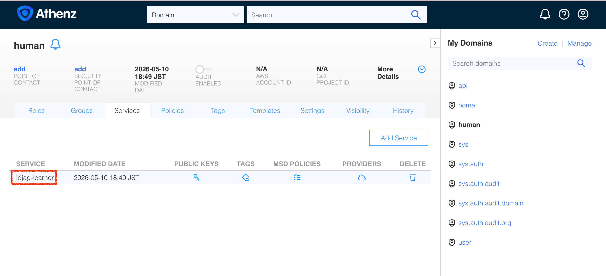
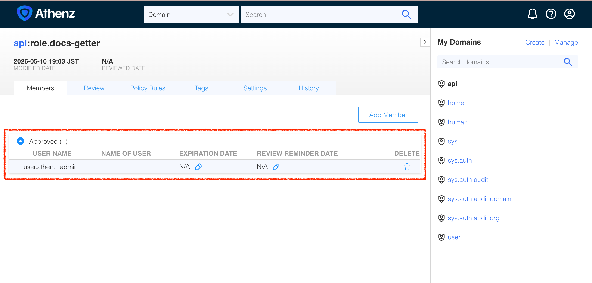
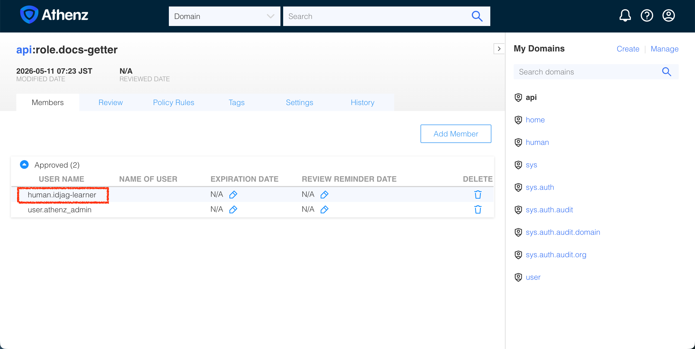

| 前へ | 現在 | 次へ |
|:---:|:---:|:---:|
| [アクセストークン（Access Token）](./06-access-token.md) | **権限の細分化** | [リソースサーバー（Resource Server）向け MCP サーバー](./08-mcp-server-for-resource-server.md) |

<a id="granular-permission"></a>

# 権限の細分化

前の章では管理者の証明書でアクセストークン（Access Token）を取得しました。この章では管理者の認証情報を使わず、演習専用の ID を作成して、`api:role.docs-getter` スコープ（Scope）でアクセスできることを確認します：

<!-- TOC depthFrom:2 depthTo:2 -->

- [演習用 ID を作成する](#create-a-learner-identity)
- [演習用 ID でアクセストークンをリクエストする](#fetch-an-access-token-as-the-learner)
- [ロールのメンバーか確認する](#troubleshoot-missing-role-membership)
- [演習用 ID に `docs-getter` 権限を付与する](#grant-the-learner-access-to-docs-getter)
- [アクセストークンを再度リクエストする](#fetch-the-access-token-again)
- [保護された API を呼び出す](#call-the-protected-api)
- [アーキテクチャを確認する](#review-architecture)

<!-- /TOC -->

<details>
<summary>専用の ID が必要な理由</summary>
<br>

管理者の認証情報を使うと、ドメインの作成、サービスの登録、ポリシーの変更まで行えます。通常の API 呼び出しに使うと、リクエストに必要な範囲を超える権限を与えてしまいます。

演習者を表すサービス ID（Service Identity）`human.idjag-learner` を別に作成します。ZTS はトークンを要求したプリンシパル（Principal）が対象ロール（Role）のメンバーか確認します。API は発行されたトークンのスコープで操作の権限を確認します。

トークンの audience は `api`、スコープは `api:role.docs-getter` です。API はこのトークンでの文書閲覧を許可しますが、作成や削除は拒否します。トークンを持つ人は、有効期限が切れるまで閲覧権限を使える場合があります。

> [!NOTE]
> Athenz は実際のユーザー向けに UserCert もサポートします。このチュートリアルではユーザー証明書の登録より認可の流れに集中できるよう、サービス ID を使います。
</details>

<a id="create-a-learner-identity"></a>

## 演習用 ID を作成する

ID と証明書の作成用スクリプトで `human.idjag-learner` を作成します：

```sh
./tools/athenz/create-tld.sh "human"
./tools/athenz/create-private-key.sh "./keys/idjag-learner"
./tools/athenz/create-service.sh "human" "idjag-learner" "./keys/idjag-learner.public.key"
./tools/athenz/enable-cert-provider.sh "human" "idjag-learner"
./tools/athenz/fetch-cert.sh "human" "idjag-learner" "./keys/idjag-learner.key" "v1"
```

```sh
#   ·  Creating TLD: human...
#   ✔  TLD created: human
#   ·  Generating RSA key pair for: ./keys/idjag-learner...
#   ✔  Keys generated: ./keys/idjag-learner.key, ./keys/idjag-learner.public.key
#   ·  Registering Service: human.idjag-learner...
#   ✔  Service registered: human.idjag-learner
#   ·  Enabling ZTS Certificate Provider for human.idjag-learner...
# [Template(s) successfully applied to domain]
#   ✔  ZTS Certificate Provider enabled for human.idjag-learner
#   ·  Fetching X.509 Certificate for human.idjag-learner..
#   ·  Fetching X.509 Certificate for human.idjag-learner...
#   ✔  Certificate saved to: ./keys/idjag-learner.crt
```

次の図に、新しい `human` ドメインと `human.idjag-learner` サービス ID、`api` ドメインの保護された API を示します：


サービスのページを開き、演習用 ID を確認します：

```sh
./tools/open.sh "http://localhost:$(./tools/port.sh athenz-ui)/domain/human/service"
```



<a id="fetch-an-access-token-as-the-learner"></a>

## 演習用 ID でアクセストークンをリクエストする

同じ `api:role.docs-getter` スコープを要求しますが、管理者の代わりに `human.idjag-learner` として認証します。

> [!WARNING]
> このコマンドは失敗します。意図した結果です。

```sh
_scope="api:role.docs-getter"
_my_access_token=$(./tools/athenz/fetch-access-token.sh \
  "./keys/idjag-learner.crt" \
  "./keys/idjag-learner.key" \
  "${_scope}" \
  "./keys/idjag-learner.jwt")
```

```sh
#   ·  Fetching Access Token for scope: api:role.docs-getter...
#   ✘  Failed to issue an access token. ZTS Response:
# {
#   "code": 403,
#   "message": "postaccesstokenrequest: principal human.idjag-learner is not included in the requested role(s) in domain api"
# }
#
# ✘ Token issuance failed for scope: api:role.docs-getter
```

<a id="troubleshoot-missing-role-membership"></a>

## ロールのメンバーか確認する

演習用 ID は存在しますが、まだ `api:role.docs-getter` のメンバーではありません。Athenz はデフォルトでアクセスを拒否するため、ZTS はこのロールのトークン発行を拒否します。

ロールのメンバーページを開いて確認します：

```sh
./tools/open.sh "http://localhost:$(./tools/port.sh athenz-ui)/domain/api/role/docs-getter/members"
```



<a id="grant-the-learner-access-to-docs-getter"></a>

## 演習用 ID に `docs-getter` 権限を付与する

`human.idjag-learner` を `api:role.docs-getter` に追加します：

```sh
./tools/athenz/add-role-member.sh "api" "docs-getter" "human.idjag-learner"
```

```sh
#   ·  Adding Member human.idjag-learner to Role: api:role.docs-getter...
#   ✔  human.idjag-learner  →  api:role.docs-getter
```

ロールのメンバーページをもう一度開きます：

```sh
./tools/open.sh "http://localhost:$(./tools/port.sh athenz-ui)/domain/api/role/docs-getter/members"
```



<a id="fetch-the-access-token-again"></a>

## アクセストークンを再度リクエストする

演習用 ID がロールのメンバーになったので、トークンを再度リクエストします：

```sh
_scope="api:role.docs-getter"
_my_access_token=$(./tools/athenz/fetch-access-token.sh \
  "./keys/idjag-learner.crt" \
  "./keys/idjag-learner.key" \
  "${_scope}" \
  "./keys/idjag-learner.jwt")
```

```sh
#   ·  Fetching Access Token for scope: api:role.docs-getter...
#   ✔  Access token issued for scope: api:role.docs-getter
# {
#   "kid": "athenz-zts-server-6966ff7f66-4j67d",
#   "typ": "at+jwt",
#   "alg": "RS256"
# }
# {
#   "sub": "human.idjag-learner",
#   "scp": [
#     "docs-getter"
#   ],
#   "ver": 1,
#   "iss": "athenz-zts-server-6966ff7f66-4j67d",
#   "client_id": "human.idjag-learner",
#   "aud": "api",
#   "uid": "human.idjag-learner",
#   "auth_time": 1778451929,
#   "scope": "docs-getter",
#   "cnf": {
#     "x5t#S256": "QUXJN5ALSWRR_fK5iHMwo0hnmlp01mcnyiNcd141o1E"
#   },
#   "exp": 1778455529,
#   "iat": 1778451929,
#   "jti": "cca1a64e-f309-47bd-94b9-3cef584663ef"
# }
```

<a id="send-request-to-the-protected-server"></a>

<a id="call-the-protected-api"></a>

## 保護された API を呼び出す

前の手順で取得した演習用トークンで、保護された API サーバーにリクエストを送ります：

```sh
curl -sS -k -H "Authorization: Bearer $_my_access_token" http://localhost:14443/api/docs | jq .
```

```sh
# {
#   "docs": [
#     {
#       "name": "first default doc",
#       "id": 1,
#       "content": "hello world"
#     },
#     {
#       "name": "second default doc",
#       "id": 2,
#       "content": "how are you?"
#     }
#   ]
# }
```

> [!TIP]
> ロールのメンバーを変更した直後にトークンの発行が失敗した場合は、ZTS に変更が反映されるまで数秒待ち、新しいトークンをリクエストしてください。API は発行済みトークンのスコープを確認しますが、ポリシーの同期は行いません。

<a id="review-architecture"></a>

## アーキテクチャを確認する

管理者ではないサービス ID（`human.idjag-learner`）の X.509 証明書を取得しました。この証明書で認証し、`api:role.docs-getter` スコープの Athenz アクセストークンをリクエストできました：


これで演習者はスコープを指定したアクセストークンで文書を閲覧できます。次の章では MCP サーバーから API を利用できるようにします。

次へ：[リソースサーバー（Resource Server）向け MCP サーバー](./08-mcp-server-for-resource-server.md)
