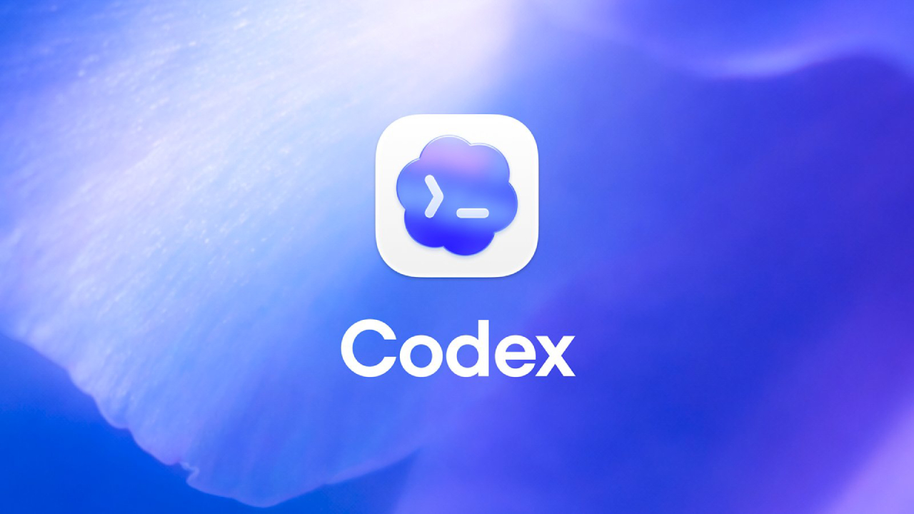

| 前へ | 現在 | 次へ |
|:---:|:---:|:---:|
| [リソースサーバー（Resource Server）向け MCP サーバー](./08-mcp-server-for-resource-server.md) | **Codex** | [MCP サーバーの保護](./10-protect-mcp-server.md) |

<a id="codex"></a>

# Codex

この章から **Codex** を使います。日本語版チュートリアルは Codex の経路を扱います。[Claude Code](../09-ai-agent.md) または [Open WebUI](../open_webui/09-ai-agent.md) を使う場合は、それぞれの英語版チュートリアルに進んでください。



> [!NOTE]
> Codex CLI は手元のコンピューターで動作します。OpenAI がホストするモデルを使う場合、モデルの推論はリモートで実行されるため、この経路では Ollama のようなローカルのモデル実行環境は不要です。

Codex CLI をインストールして MCP サーバーに接続し、演習用 ID の API アクセストークン（Access Token）で文書を取得します。

<!-- TOC depthFrom:2 depthTo:2 -->

- [Codex CLI をインストールする](#install-codex-cli)
- [Codex にログインする](#sign-in-to-codex)
- [Codex に MCP サーバーを追加する](#add-the-mcp-server-to-codex)
- [MCP サーバーに接続する](#connect-to-the-mcp-server)
- [接続状態を確認する](#verify)
- [文書を取得できるか確認する](#verify-working)
- [結果を確認する](#understand-the-result)
- [次のステップ](#next-steps)

<!-- /TOC -->

<a id="install-codex-cli"></a>

## Codex CLI をインストールする

Codex がすでにインストールされているか確認します：

```sh
codex --version
```

```sh
# codex-cli X.XXX.X
```

Codex がない場合は [Node.js と npm](https://nodejs.org/en/download) をインストールし、次のコマンドを実行します：

```sh
npm install -g @openai/codex
```

> [!NOTE]
> 別のインストール方法については、[Codex CLI の公式ドキュメント](https://developers.openai.com/codex/cli/)を参照してください。

<a id="login-to-codex"></a>

<a id="sign-in-to-codex"></a>

## Codex にログインする

Codex を起動し、案内に従ってログインします：

```sh
codex
```

**Sign in with ChatGPT** または利用可能な別の認証方法を選びます。対応する方法は[認証ガイド](https://learn.chatgpt.com/docs/auth)で確認できます。ログイン後、シェルから MCP 接続を設定するために Codex を終了します。

<a id="add-the-mcp-server-to-codex"></a>

## Codex に MCP サーバーを追加する

次のブロックで新しい API アクセストークンを取得し、ローカルの Codex 設定ファイルを作成して設定を追記します。MCP サーバーは各リクエストに含まれる Bearer トークンを API に渡します：

```sh
_mcp_port=$(./tools/port.sh mcp)
_scope="api:role.docs-getter"
_my_access_token=$(./tools/athenz/fetch-access-token.sh \
  "./keys/idjag-learner.crt" \
  "./keys/idjag-learner.key" \
  "${_scope}" \
  "./keys/idjag-learner.jwt")

cat > .codex/config.toml <<EOF
[mcp_servers.id-jag-the-hard-way-mcp]
url = "http://localhost:${_mcp_port}/mcp"
http_headers = { Authorization = "Bearer ${_my_access_token}" }
EOF

cat .codex/settings.toml >> .codex/config.toml
```

作成された設定ファイルを確認します：

```sh
cat .codex/config.toml
```

```sh
# [mcp_servers.id-jag-the-hard-way-mcp]
# url = "http://localhost:<your_port>/mcp"
# http_headers = { Authorization = "Bearer <your_access_token>" }

# [mcp_servers.id-jag-the-hard-way-mcp.tools.get_k8s_docs]
# approval_mode = "approve"

# [mcp_servers.id-jag-the-hard-way-mcp.tools.delete_k8s_doc]
# approval_mode = "approve"

# [mcp_servers.id-jag-the-hard-way-mcp.tools.post_k8s_doc]
# approval_mode = "approve"
```

<a id="connect-to-mcp-server"></a>

<a id="connect-to-the-mcp-server"></a>

## MCP サーバーに接続する

プロジェクトのディレクトリで Codex を起動します：

```sh
codex
```

Codex が接続し、三つの文書操作用ツールを検出できるはずです。

<a id="verify"></a>

## 接続状態を確認する

MCP の状態に `id-jag-the-hard-way-mcp` が接続済みとして表示され、三つの文書操作用ツールがすべて見えることを確認します：

```sh
/mcp verbose
```

```sh
# 🔌  MCP Tools

#   • id-jag-the-hard-way-mcp: connected (3 tools)
#     • Auth: Bearer token
#     • Tools: delete_k8s_doc, get_k8s_docs, post_k8s_doc
#     • Resources: (none)
#     • Resource templates: (none)
```

<a id="verify-working"></a>

## 文書を取得できるか確認する


Codex に文書操作用ツールの呼び出しを依頼します：

```sh
Get docs with id-jag-the-hard-way-mcp
```


ツールはステータス `200` と文書一覧を返すはずです。トークンの期限切れで API が拒否した場合は、上のトークン取得と設定の手順をやり直し、Codex を再起動してください。

<a id="understand-the-result"></a>

## 結果を確認する

ツール一覧の取得では API を呼ばず、ツール定義だけを読みます。Codex が `get_k8s_docs` を呼ぶと、MCP サーバーはリクエストの Authorization ヘッダーにある API トークンを渡します。API はトークンと文書閲覧権限を検証します。


<a id="next-steps"></a>

## 次のステップ

これで AI クライアントが MCP 経由で文書を取得できました。次の章では、ツール実行前にアクセストークンを検証する Runtime Proxy を追加します。

次へ：[MCP サーバーの保護](./10-protect-mcp-server.md)
