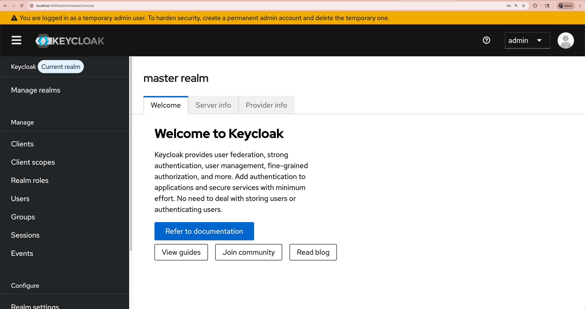
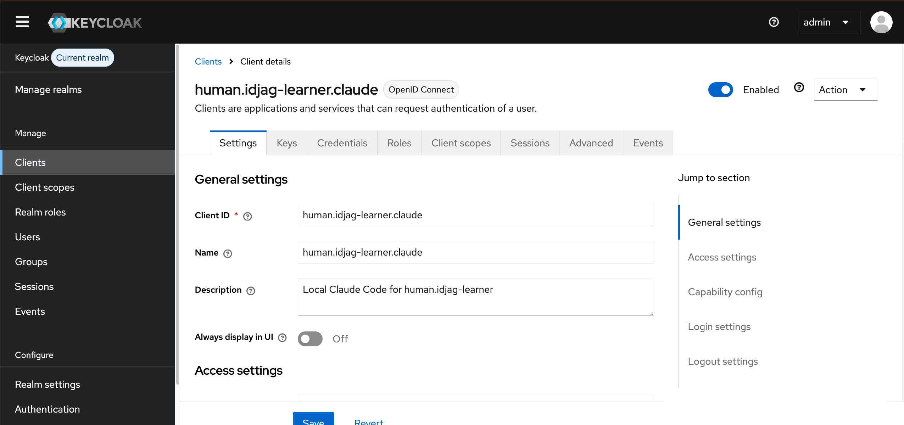
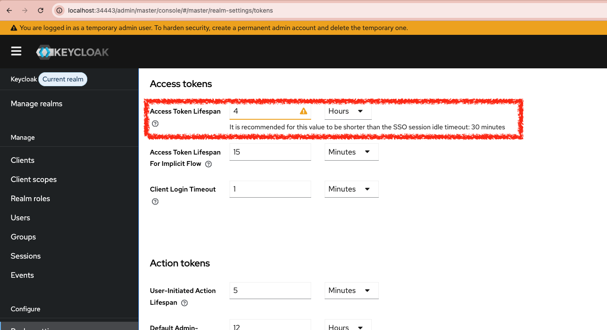

| 前へ | 現在 | 次へ |
|:---:|:---:|:---:|
| [トークン交換（Token Exchange）](./11-token-exchange.md) | **ID プロバイダー（Identity Provider, IdP）** | [信頼する ID プロバイダー（Identity Provider, IdP）](./13-trusted-identity-provider.md) |

<a id="identity-provider--codex"></a>

# ID プロバイダー（Identity Provider, IdP）— Codex

[Keycloak](https://www.keycloak.org/) を ID プロバイダーとしてデプロイします。ユーザーは Keycloak にログインし、ID トークン（ID Token）を受け取ります。

<!-- TOC depthFrom:2 depthTo:2 -->

- [Keycloak イメージを取得して読み込む](#load-the-keycloak-image)
- [Keycloak を Kubernetes にデプロイする](#deploy-keycloak-in-k8s)
- [ブラウザーで Keycloak を開く](#open-keycloak-in-your-browser)
- [Keycloak クライアントを登録する](#register-the-keycloak-client)
- [演習用ユーザーを作成する](#create-the-learner-account)
- [トークンの有効期間を設定する](#configure-the-token-lifespan)
- [結果を確認する](#review-the-result)
- [次のステップ](#next-steps)

<!-- /TOC -->

<a id="docker-pull-keycloak"></a>

<a id="load-the-keycloak-image"></a>

## Keycloak イメージを取得して読み込む

Docker のアーキテクチャ（`arm64` または `amd64`）に合う `quay.io/keycloak/keycloak:latest` イメージを用意します。現在の `kubectl` コンテキストが kind クラスターなら、同じイメージ名でそのクラスターに読み込みます：

```sh
./scripts/keycloak/download-and-load-keycloak.sh
```

```sh
# Preparing quay.io/keycloak/keycloak:latest for linux/arm64...
# [+] Building 1.4s (5/5) FINISHED                                                                              docker:desktop-linux
# ...

# View build details: docker-desktop://dashboard/build/desktop-linux/desktop-linux/qqbttlri10dikdejvpcem98up
# Image: "quay.io/keycloak/keycloak:latest" with ID "sha256:dc0f6a6c61f4170f154b6dd89dfc160c839fd24989d2c798af2a7072498bfbac" not yet present on node "test-control-plane", loading...
# Loaded quay.io/keycloak/keycloak:latest into kind cluster test.
```

たとえば `kind-test` コンテキストでは `test` クラスターにイメージを読み込みます。ほかの Kubernetes 環境では、デプロイ時に元のイメージを取得します。

<a id="deploy-keycloak-in-k8s"></a>

## Keycloak を Kubernetes にデプロイする

`idp` ネームスペースを作成します：

```sh
kubectl create ns idp
```

```sh
# namespace/idp created
```

どの環境でも同じイメージ名で Keycloak をデプロイします：

```sh
kubectl create deployment keycloak --image=quay.io/keycloak/keycloak:latest -n idp
```

```sh
# deployment.apps/keycloak created
```

管理者のログイン情報を設定し、開発モードで起動します。kind に読み込んだイメージを使うため、`imagePullPolicy: IfNotPresent` も設定します。設定しないと `latest` タグには既定で `Always` が適用され、イメージがローカルにあってもレジストリに接続します：

```sh
_keycloak_admin=$(./tools/config.sh keycloak admin)
_keycloak_admin_password=$(./tools/config.sh keycloak admin-password)

kubectl patch deploy keycloak -n idp --patch "$(cat <<EOF
spec:
  template:
    spec:
      containers:
        - name: keycloak
          imagePullPolicy: IfNotPresent
          args:
            - start-dev
          env:
            - name: KEYCLOAK_ADMIN
              value: "${_keycloak_admin}"
            - name: KEYCLOAK_ADMIN_PASSWORD
              value: "${_keycloak_admin_password}"
EOF
)"
```

```sh
# deployment.apps/keycloak patched
```

Pod を再起動しても Keycloak のデータが残るよう、PVC を作成します：

```sh
cat <<EOF | kubectl apply -f -
apiVersion: v1
kind: PersistentVolumeClaim
metadata:
  name: keycloak-data-pvc
  namespace: idp
spec:
  accessModes: [ "ReadWriteOnce" ]
  resources:
    requests:
      storage: 1Gi
EOF
```

```sh
# persistentvolumeclaim/keycloak-data-pvc created
```

PVC をマウントします：

```sh
kubectl patch deploy keycloak -n idp --patch "$(cat <<'EOF'
spec:
  template:
    spec:
      containers:
        - name: keycloak
          volumeMounts:
            - name: keycloak-data
              mountPath: /opt/keycloak/data
      volumes:
        - name: keycloak-data
          persistentVolumeClaim:
            claimName: keycloak-data-pvc
EOF
)"
```

```sh
# deployment.apps/keycloak patched
```

Deployment にアクセスするための Service を作成します：

```sh
kubectl expose deployment keycloak --port=8080 -n idp
```

```sh
# service/keycloak exposed
```

<a id="open-keycloak-on-browser"></a>

<a id="open-keycloak-in-your-browser"></a>

## ブラウザーで Keycloak を開く

Pod の準備が完了するまで待ちます：

```sh
kubectl wait -n idp \
  --for=condition=ready pod \
  --selector=app=keycloak \
  --timeout=180s
```

```sh
# pod/keycloak-<pod-suffix> condition met
```

ブラウザーで Keycloak を開きます（ユーザー名：`admin`、パスワード：`admin`）：

```sh
_keycloak_port=$(./tools/port.sh keycloak)
./tools/open.sh "http://localhost:${_keycloak_port}"
```



<a id="setup-client"></a>

<a id="register-the-keycloak-client"></a>

## Keycloak クライアントを登録する

Keycloak の **Client** は、ユーザーに代わって認証（Authentication）を要求するアプリケーションです。ここでは既定の `master` realm を使います。

AI クライアント（`human.idjag-learner.codex`）を Keycloak に登録します：

```sh
_acg_port=$(./tools/port.sh ai-client-gateway-codex)
./tools/keycloak/create-client.sh \
  human.idjag-learner.codex \
  "http://localhost:${_acg_port}/oauth/callback" \
  "http://localhost:${_acg_port}"
```



<a id="setup-user"></a>

<a id="create-the-learner-account"></a>

## 演習用ユーザーを作成する

演習者を表すユーザーアカウントを作成します：

```sh
OPEN_UI=true ./tools/keycloak/create-user.sh \
  idjag-learner \
  idjag-learner@athenz.io \
  ID-JAG \
  Learner
```

<a id="setup-id_token-expiration"></a>

<a id="configure-the-token-lifespan"></a>

## トークンの有効期間を設定する

> [!TIP]
> この演習では realm のトークン有効期間を 4 時間に設定します。演習用スクリプトは Keycloak の `accessTokenLifespan` を変更します。学習環境以外ではセキュリティ要件に合う有効期間を選んでください。

```sh
./tools/keycloak/set-token-lifespan.sh 14400
```

```sh
#   ·  Fetching Keycloak admin token...
#   ·  Setting access token lifespan to 14400s in realm master...
#   ✔  Access token lifespan set to 14400s (4h)
#   ✔  Opened: http://localhost:34443/admin/master/console/#/master/realm-settings/tokens
```



<a id="whats-done"></a>

<a id="review-the-result"></a>

## 結果を確認する

Keycloak をデプロイし、次のものを作成しました：

- AI クライアント（Codex CLI）を表すクライアント `human.idjag-learner.codex`
- API へのアクセスを要求する人を表すユーザー `idjag-learner`

<a id="whats-next"></a>

<a id="next-steps"></a>

## 次のステップ

Keycloak の準備はできましたが、Athenz はまだ Keycloak の ID トークンを信頼していません。次の章では Athenz がこのトークンを受け入れて検証できるよう設定します。

次へ：[信頼する ID プロバイダー（Identity Provider, IdP）](./13-trusted-identity-provider.md)
