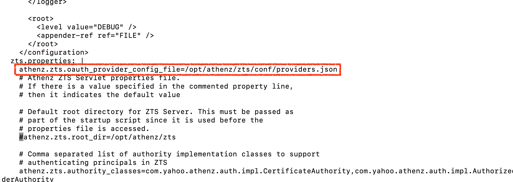

| 前へ | 現在 | 次へ |
|:---:|:---:|:---:|
| [ID プロバイダー（Identity Provider, IdP）](./12-identity-provider.md) | **信頼する ID プロバイダー（Identity Provider, IdP）** | [AI Client Gateway](./14-ai-client-gateway.md) |

<a id="trusted-identity-provider--codex"></a>

# 信頼する ID プロバイダー（Identity Provider, IdP）— Codex

認可サーバー（Authorization Server）である Athenz は、どの ID プロバイダー（Identity Provider, IdP）が発行したトークンでも信頼できるわけではありません。Athenz の管理者が、信頼する IdP を明示的に設定する必要があります。

前の章で Keycloak をデプロイしましたが、Athenz はまだ Keycloak を信頼していません。この章では Keycloak を信頼する IdP として登録し、Keycloak が発行した ID トークン（ID Token）を検証して ID-JAG に交換できるよう設定します。

<!-- TOC depthFrom:2 depthTo:2 -->

- [信頼設定を理解する](#understand-the-trust-configuration)
- [ZTS サーバーにプラグインをインストールする](#install-plugin-into-the-zts-server)
- [プラグインを Keycloak に接続する](#connect-keycloak-with-the-plugin)
- [ZTS がプラグインを読み込むよう設定する](#configure-zts-to-load-the-plugin)
- [結果を確認する](#review-the-result)
- [次のステップ](#next-steps)

<!-- /TOC -->

<a id="understand-what-we-need-to-do"></a>

<a id="understand-the-trust-configuration"></a>

## 信頼設定を理解する

現在のデプロイには Keycloak を信頼する設定がありません。Keycloak の ID トークンを ID-JAG に交換するには、次の作業が必要です：

1. Athenz が Keycloak のトークンを検証できるようプラグインをインストールする
2. トークンの署名を検証できるよう、Keycloak の `jwks_uri` をプラグインに渡す
3. ZTS サーバーにプラグイン設定ファイルの場所を指定する


<a id="install-plugin-into-the-zts-server"></a>

## ZTS サーバーにプラグインをインストールする

Keycloak トークン交換プロバイダーの JAR を ZTS サーバーにマウントするパッチを適用します：

```sh
kubectl patch deployment athenz-zts-server \
  -n athenz \
  --patch-file components/keycloak_token_exchange_provider/hack/static/zts-plugin-jar-mount-patch.yaml
```

```sh
# deployment.apps/athenz-zts-server patched
```

ロールアウトが終わるまで待ちます：

```sh
kubectl rollout status deployment/athenz-zts-server -n athenz
```

```sh
# Waiting for deployment "athenz-zts-server" rollout to finish: 0 of 1 updated replicas are available...
# deployment "athenz-zts-server" successfully rolled out
```

JAR がマウントされたことを確認します：

```sh
kubectl -n athenz exec deployment/athenz-zts-server \
  -c athenz-zts-server \
  -- sh -c "ls -al /opt/athenz/zts/lib/jars | grep keycloak"
```

```sh
# -rw-r--r-- 1 root root 3237 May 1 14:26 keycloak-token-provider.jar
```

これで `KeycloakTokenExchangeProvider` プラグインの JAR が ZTS サーバーにマウントされました：


<a id="connect-keycloak-with-the-plugin"></a>

## プラグインを Keycloak に接続する

プラグインが Keycloak インスタンスを参照するよう、`providers.json` ConfigMap を作成します：

```sh
cat <<EOF | kubectl apply -f -
apiVersion: v1
kind: ConfigMap
metadata:
  name: zts-providers-config
  namespace: athenz
data:
  providers.json: |
    [
      {
        "issuerUri": "http://localhost:$(./tools/port.sh keycloak)/realms/master",
        "jwksUri": "http://keycloak.idp:8080/realms/master/protocol/openid-connect/certs",
        "providerClassName": "com.mlajkim.athenz.KeycloakTokenExchangeProvider"
      }
    ]
EOF
```

```sh
# configmap/zts-providers-config created
```

ZTS サーバーから Keycloak の JWKS エンドポイントにアクセスできることを確認します：

```sh
kubectl -n athenz exec deployment/athenz-zts-server -c athenz-zts-server -- \
  sh -c "curl -k http://keycloak.idp:8080/realms/master/protocol/openid-connect/certs | jq ."
```

レスポンスの `keys` 配列に公開鍵が含まれるはずです。以下はほかの鍵フィールドを省略した例です。鍵 ID と鍵の数は環境ごとに異なります：

```sh
# {
#   "keys": [
#     {
#       "kid": "<key-id>",
#       ...
#     }
#   ]
# }
```

ConfigMap を ZTS サーバーにマウントします：

```sh
kubectl patch deployment athenz-zts-server \
  -n athenz \
  --patch-file components/keycloak_token_exchange_provider/hack/static/zts-providers-config-patch.yaml
```

```sh
# deployment.apps/athenz-zts-server patched
```

コンテナ内にファイルがあることを確認します：

```sh
kubectl -n athenz exec deployment/athenz-zts-server \
  -c athenz-zts-server \
  -- sh -c "cat /opt/athenz/zts/conf/providers.json"
```

```sh
# [
#   {
#     "issuerUri": "http://localhost:34443/realms/master",
#     "jwksUri": "http://keycloak.idp:8080/realms/master/protocol/openid-connect/certs",
#     "providerClassName": "com.mlajkim.athenz.KeycloakTokenExchangeProvider"
#   }
# ]
```

<a id="configure-zts-to-load-the-plugin"></a>

## ZTS がプラグインを読み込むよう設定する

ファイルをマウントするだけでは足りません。ZTS サーバーにファイルの場所を指定します。`kubectl edit` で ZTS ConfigMap を編集します：

```sh
KUBE_EDITOR=vim kubectl edit configmap athenz-zts-conf -n athenz
```

`vim` では次の順に操作します：

1. `/zts.prop` と入力して **Enter** を押し、properties セクションに移動する
2. `o` を押して下に新しい行を作り、入力モードに切り替える
3. スペースキーを 4 回押して 4 文字分インデントする（自動インデントが有効なら合計 4 文字に調整する）
4. 次の行を貼り付ける

```
athenz.zts.oauth_provider_config_file=/opt/athenz/zts/conf/providers.json
```



5. **Esc** を押し、`:wq!` と入力して **Enter** を押して保存する

次のように表示されるはずです：

```sh
# configmap/athenz-zts-conf edited
```

新しい設定を読み込むため、ZTS サーバーを再起動します：

```sh
kubectl -n athenz rollout restart deployment athenz-zts-server
```

```sh
# deployment.apps/athenz-zts-server restarted
```

ロールアウトが終わるまで待ちます：

```sh
kubectl rollout status deployment/athenz-zts-server -n athenz
```

```sh
# Waiting for deployment "athenz-zts-server" rollout to finish: 0 of 1 updated replicas are available...
# deployment "athenz-zts-server" successfully rolled out
```

設定が適用されたことを確認します：

```sh
kubectl logs -n athenz deployment/athenz-zts-server -c athenz-zts-server | grep "oauth_provider_config_file"
```

```sh
# 12:34:56.233 [main] INFO  c.y.a.c.s.util.config.ConfigManager - configuration "athenz.zts.oauth_provider_config_file" created
```

> [!NOTE]
> プラグインは Keycloak トークンの `preferred_username` クレームを Athenz プリンシパル（Principal）`human.[preferred_username]` に対応付けます。そのため、Keycloak の `idjag-learner` は Athenz では `human.idjag-learner` になります。

<a id="review-summary-of-changes"></a>

<a id="review-the-result"></a>

## 結果を確認する

`KeycloakTokenExchangeProvider` プラグインをインストールしました。このプラグインは Keycloak の ID トークンを受け取り、Keycloak の公開鍵で署名とクレームを検証して、認証された Athenz プリンシパルを返します：


<a id="whats-next"></a>

<a id="next-steps"></a>

## 次のステップ

これで Athenz は Keycloak の ID トークンを信頼します。次の章では Codex CLI から Keycloak のログインを使えるよう、AI Client Gateway をデプロイします。

次へ：[AI Client Gateway](./14-ai-client-gateway.md)
