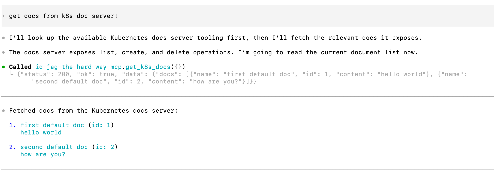

| 前へ | 現在 | 次へ |
|:---:|:---:|:---:|
| [AI Client Gateway](./14-ai-client-gateway.md) | **ID-JAG** | *チュートリアルの最終章です 🎉* |

<a id="id-jag--codex"></a>

# ID-JAG — Codex

AI Client Gateway に、Keycloak の ID トークン（ID Token）を ID-JAG に交換する権限を付与します。文書リクエストを再試行して成功を確認し、各サービスがトークンを検証する過程をログで追います。

<!-- TOC depthFrom:2 depthTo:2 -->

- [`human.idjag-learner.codex` に権限を付与する](#grant-permissions-to-humanidjag-learnercodex)
- [文書を取得できるか確認する](#verify)
- [動作を確認する](#understand-the-result)
- [まとめ](#finally)
- [おわりに](#closing)

<!-- /TOC -->

<a id="grant-permissions-to-humanidjag-learnercodex"></a>

## `human.idjag-learner.codex` に権限を付与する

`human.idjag-learner.codex` サービスには、対象ロールに対する JAG 交換権限が必要です。

文書アクセス用の `api` ドメインと MCP アクセス用の `mcp` ドメインに、それぞれ JAG 交換ロールを作成します。ゲートウェイは一つの ID-JAG で両方のスコープ（Scope）を要求し、受信先（audience）が `mcp` のアクセストークン（Access Token）に交換します：

```sh
./tools/athenz/create-role.sh "api" "docs-getter-jag-exchanger"
./tools/athenz/create-role.sh "mcp" "mcp-accessor-jag-exchanger"
```

```sh
#   ·  Creating Role: api:role.docs-getter-jag-exchanger...
#   ✔  Role created: api:role.docs-getter-jag-exchanger
#   ·  Creating Role: mcp:role.mcp-accessor-jag-exchanger...
#   ✔  Role created: mcp:role.mcp-accessor-jag-exchanger
```

`api:role.docs-getter` と `mcp:role.mcp-accessor` を対象に `zts.jag_exchange` アクションを許可します：

```sh
./tools/athenz/add-policy.sh "api" "docs-getter-jag-exchanger" "zts.jag_exchange" "role.docs-getter"
./tools/athenz/add-policy.sh "mcp" "mcp-accessor-jag-exchanger" "zts.jag_exchange" "role.mcp-accessor"
```

```sh
#   ·  Creating Policy: api:policy.docs-getter-jag-exchanger_zts_jag_exchange_role_docs-getter...
#   ✔  Policy created: api:policy.docs-getter-jag-exchanger_zts_jag_exchange_role_docs-getter
#   ·  Creating Policy: mcp:policy.mcp-accessor-jag-exchanger_zts_jag_exchange_role_mcp-accessor...
#   ✔  Policy created: mcp:policy.mcp-accessor-jag-exchanger_zts_jag_exchange_role_mcp-accessor
```

`human.idjag-learner.codex` を両方のロールのメンバーに追加します：

```sh
./tools/athenz/add-role-member.sh "api" "docs-getter-jag-exchanger" "human.idjag-learner.codex"
./tools/athenz/add-role-member.sh "mcp" "mcp-accessor-jag-exchanger" "human.idjag-learner.codex"
```

```sh
#   ·  Adding Member human.idjag-learner.codex to Role: api:role.docs-getter-jag-exchanger...
#   ✔  human.idjag-learner.codex  →  api:role.docs-getter-jag-exchanger
#   ·  Adding Member human.idjag-learner.codex to Role: mcp:role.mcp-accessor-jag-exchanger...
#   ✔  human.idjag-learner.codex  →  mcp:role.mcp-accessor-jag-exchanger
```

<a id="verify"></a>

## 文書を取得できるか確認する

新しい権限で接続し直すため、Codex を終了します：

```sh
/quit
```

ターミナルに戻り、プロジェクトのディレクトリで Codex を再起動します：

```sh
codex
```

Codex で MCP の接続状態を確認します：

```sh
/mcp
```

```sh
# 🔌  MCP Tools
#
#   • id-jag-the-hard-way-mcp: connected (3 tools)
```

今度は `failed` が表示されず、三つのツールが使える状態になりました。

前の章で失敗したプロンプトをもう一度送ります：

```sh
Get docs with id-jag-the-hard-way-mcp
```



レスポンスには API が返した文書が含まれるはずです。

<a id="whats-happened"></a>

<a id="understand-the-result"></a>

## 動作を確認する

AI Client Gateway はログインしたユーザーの Keycloak ID トークンを受け取り、ID-JAG に交換して Athenz アクセストークンを取得しました。

ゲートウェイはリクエストとレスポンスも記録するため、トークン交換に関するメッセージだけを抽出して直近 7 行を確認します：

```sh
kubectl logs deploy/codex-idjag-learner-ai-client-gateway -n human -c ai-client-gateway --tail=100 \
  | grep -E '^\[Athenz (ID-JAG|AT)\]' \
  | tail -n 7
```

```sh
# [Athenz ID-JAG] 🔑 Resolved ID token from bearer session (Claude Code path)
# [Athenz ID-JAG] 🔄 Attempting to exchange new ID-JAG with id-token for scope [api:role.docs-getter mcp:role.mcp-accessor] ...
# [Athenz ID-JAG] 🎯 Target ZTS for ID-JAG: https://athenz-zts-server.athenz:4443/zts/v1/oauth2/token
# [Athenz ID-JAG] 🎫 Granted scope in ID-JAG: "api:role.docs-getter mcp:role.mcp-accessor"
# [Athenz AT] Fetching Athenz Access Token using ID-JAG ...
# [Athenz AT] 🎯 Target ZTS for AT: https://athenz-zts-server.athenz:4443/zts/v1/oauth2/token
# [Athenz AT] 🔑 Successfully fetched Athenz Access Token. Granted scope: ["api:role.docs-getter","mcp-accessor"]
```

<a id="finally"></a>

## まとめ

🎉 これで「ID-JAG The Hard Way」チュートリアルは完了です。

ユーザーのログインから委任された API アクセスまでをつなぎました。Athenz のポリシーはトークンの発行と交換を制御し、プロキシと API はそれぞれのトークンの audience とスコープを検証します。ロールのメンバーを変更すると、ZTS が変更を反映した後の新しいトークン発行に適用されます。発行済みのトークンは有効期限まで利用できる場合があります。

構築した流れの全体像は次のとおりです：


<a id="closing"></a>

## おわりに

このチュートリアルが役に立ったら、GitHub の二つのリポジトリのどちらかに ⭐ を付けていただけるとうれしいです。

| リポジトリ                                                                       | スター                                                                                                                                                                                                   | フォーク                                                                                                                                                                                              |
|----------------------------------------------------------------------------------|---------------------------------------------------------------------------------------------------------------------------------------------------------------------------------------------------------|----------------------------------------------------------------------------------------------------------------------------------------------------------------------------------------------------|
| [元のリポジトリ](https://github.com/mlajkim/id-jag-the-hard-way)                | [](https://github.com/mlajkim/id-jag-the-hard-way/stargazers)                    | [](https://github.com/mlajkim/id-jag-the-hard-way/forks)                    |
| [Athenz コミュニティフォーク](https://github.com/athenz-community/id-jag-the-hard-way) | [](https://github.com/athenz-community/id-jag-the-hard-way/stargazers) | [](https://github.com/athenz-community/id-jag-the-hard-way/forks) |

問題や質問があれば[イシューを作成してください](https://github.com/mlajkim/id-jag-the-hard-way/issues)。
